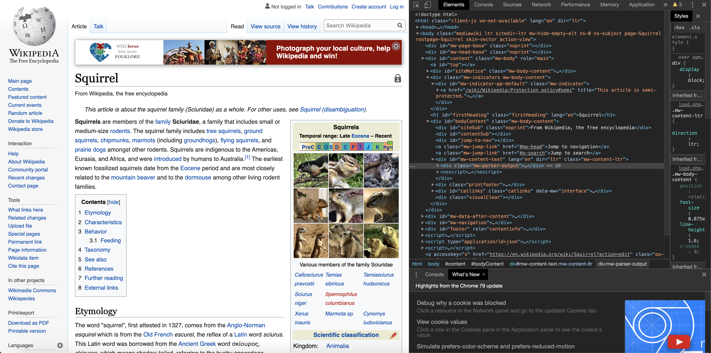

```{r setup, include=FALSE}
knitr::opts_chunk$set(echo = FALSE)
```


When I was a kid, the only way to access the internet I knew was through a web browser. You opened it up and sort of like stepping through a portal you went into the world of the internet, that was somewhere "out there".
When I heard about web-crawlers, programs that systematically traverse and analyse the web, for the first time, I imagined a program that would open up your browser and load one website after another, dozens of tabs at a time, at a speed too fast for the human eye to follow. I was awestruck by the mere thought of it! As you might imagine, that’s not quite how it works. As you might also imagine, I didn’t have the slightest idea about how the internet worked. Well, a decade or so later, I still don’t really know how the internet works deep down, but I recently found out that I do know enough R to build my own web-crawler. In this blog post I will share my experiences with you.

Our main tool will be the package `rvest`, [@rvest] by Hadley Wickham. This is an excellent package for obtaining content from a specific webpage given its URL. However, `rvest` does not natively crawl, that is, it does not traverse from one webpage to the next. So our goal will be to implement this crawling mechanism. As a case study we will start with the Wikipedia page for "squirrel" and systematically visit all the other English Wikipedia pages that can be reached with no more than two clicks. Mathematically speaking, we are extracting the 2-neighborhood of the hyperlink network of Wikipedia's "squirrel" page. We are restricting ourselves to the English Wikipedia, because, as we will see, this already gives us a massive hyperlink network and extending the crawling to other languages would increase the size of our network even further.

**A little brain teaser before reading on:** What do you think how many (English) Wikipedia pages you can reach with just two clicks starting from the entry for "squirrel"?

### In this post I cover

- Obtaining content of a website (using `rvest`, [@rvest])
- Filtering that content for specific data (using `rvest`)
- Teaching `rvest` how to crawl (using a `while loop` and `regular expressions`)
- Making pretty graphs (using `igraph`, [@igraph], in part 2 of this series)

### General strategy

Our general strategy will be

- Start with an initial list of urls (we will talk about how to get them later),
- Visit each url, extract the name of the topic of the page and all the links to other pages,
- Add the new hyperlinks to our list of urls we want to visit,
- Keep going until we have exhausted our list or rather, until we have crawled the entire 2-neighborhood of the squirrel page.

This works, because all Wikipedia pages have the same layout (i.e. the topic name will always be located in the same place) and the hyperlinks to other topics all have the same structure (i.e. https://en.wikipedia.org/<something-something>).

# A general word of caution: rate limits and robots.txt

The code and techniques discussed here are very much general purpose and hopefully some of you might find them helpful for your own web crawling project. It is important to remember, though, that we want to make sure we are not acting "anti-socially" with our crawling program. So when you embark on your own web crawling quest, you should keep two things in particular in mind.

- We do not want to swamp the website we are crawling with too many requests in short succession. Causing too much traffic to a website is very likely to get our IP address banned and prevent us from accessing the site for some time. To prevent this from happening, we will use the `Sys.sleep()` function after downloading each webpage. `Sys.sleep(n)` will pause our program for `n` seconds before continuing its execution.
- Before rvesting any website, your should check their guidelines for crawling bots. These guidelines in particular contain directories of the website your are not allowed to crawl. They are stored in the _robots.txt_ file which is located at _website-you-want-to-crawl.{com, org, co.uk,...}/robots.txt_. For example, the rules for crawling Wikipedia are found at <https://en.wikipedia.org/robots.txt>. When looking through the _robots.txt_ file you should watch out in particular for any lines starting with 

> User-agent: *\n

This line means: "The following rules apply to _all_ bots", so you should heed any rules set out after that line. In particular, if you encounter

>User-agent: *\n
>
>Disallow: /

this means that all bots are banned from accessing any pages on that website. In that case you are simply out of luck and should find a different website to crawl. Ignoring these rules is simply asking for trouble.

With all of this being said... finally on to the code!

# Single website

Let's take a look at how to obtain the information we want from a single webpage first. Once we know this, we can set up a loop to iterate over all the webpages we are interested in.

### What do we want?

Take a look at:
<https://en.wikipedia.org/wiki/Squirrel>

From this page, we want to obtain:

  - The url,
  - The name as specified by webpage topic,
  - Every hyperlink linking to another topic within the English Wikipedia.


### How do we get, what we want?

Make sure you have `rvest` and the `tidyverse` installed. If not, install them using the usual `install.packages()` command. Once you are good to go, downloading a website with `rvest` is as simple as running a single line of code.


```{r, echo=TRUE}
# for general purpose data manipulation
library(tidyverse)
# for the actual crawling
library(rvest)
url <-"https://en.wikipedia.org/wiki/Squirrel"
# big list of lists
page <- read_html(url)
```

So, what did we just download?

As the name suggests `read_html` reads the html content of a website. To get an idea of what this looks like, open <https://en.wikipedia.org/wiki/Squirrel> in your browser, right-click anywhere on the page and select "Inspect website" (if you are using Google Chrome that is; depending on your browser, the option should be similarly named). This opens up the website inspector and looking at the "Elements" header will show us the raw html for the site we are currently borwsing.



This looks quite messy. How will we ever find the information we need in that??

Well, good thing we are not the first to try something like this. We can extract the topic name using so called _css-selectors_. In short, a *css-selector* is a pattern used to select elements in an html file. You can read up on them [here](https://en.wikipedia.org/wiki/Cascading_Style_Sheets#Selector). The nice thing is, you don't even need to know how css-selectors, or css, for that matter, work, thanks to the great [SelectorGadget](https://selectorgadget.com/) Chrome extension. Simply install the extension and follow the super-easy instructions on how to use it. All you need to do is navigate to the website you are interested in, click on the SelectorGadget icon in the top-right corner and click on the area of the website for which you want to know the css-selector. In our case, SelectorGadget tells us that the topic name is located at `#firstHeading`.

```{r, echo=TRUE}
# This means: take the page we downloaded, look at what is located at "#main h1"
# and give me the text you find there.
name <- html_text(html_node(page, css = "#firstHeading"))
name
```


Very good! On to the hyperlinks.

Hyperlinks are stored in html using the *anchor tag*, the hyperlink is stored in the *href attribute* of the anchor tag. A text that appears in a browser as...

>Squirrels are members of the <a href="/wiki/Family_(biology)" title="Family (biology)">family</a> Sciuridae, a family that includes small or medium-size <a href="/wiki/Rodent" title="Rodent">rodents</a>.

...in html actually looks like this:

>Squirrels are members of the &lt;a href="/wiki/Family_(biology)" title="Family (biology)">family&lt;/a> Sciuridae, a family that includes small or medium-size &lt;a href="/wiki/Rodent" title="Rodent">rodents&lt;/a>.

An anchor tag starts with `< a ...` and we can see that the anchor tags above each have two attributes. An *href* attribute which contains a hyperlink reference, i.e. the hyperlink to the website we want to direct the user to if they click on the link and a *title* attribute. We are interested in the href attribute. So we want to tell R "go and find all the anchor tags of the page and from within these anchor tags give me the content of the href attributes". 

Furthermore, looking at the layout of the squirrel page, we realize that it is structured into various sections. There is some advert at the top, the navigation bar to the left side and the actual article on squirrels. The only hyperlinks we are interested in are those located in the actual article. Playing around with SelectorGadget some more, we find out that the css-selector for the actual article is `#bodyContent`, so we want to restrict the hyperlink extraction to that bit of the page:

```{r, echo=TRUE}
links_body <- page%>%html_node(css = "#bodyContent")%>%
  html_nodes("a")%>%
  html_attr("href")
head(links_body, 10)
length(links_body)
```

There are 885 outgoing links from the squirrel page! But as you might have guessed from the output above, not all of them are relevant to us and we need to prune that list before we can move on. We are only interested in links to other Wikipedia pages, which conveniently are all stored in the *wiki* directory of the Wikipedia website. That is, we can filter the list we obtained above for the keyword *wiki* and get rid of all the rest. Another thing to note here is that the hyperlinks are *relative paths*. For example, if we wanted to go to the Wikipedia page on Eocene (a geological epoch), we would have to type *https://en.wikipedia.org/wiki/Eocene* into the address bar of our browser. As we can see above, however, the html we downloaded only contains the last bit of that hyperlink (*/wiki/Eocene*) which is the location of the Eocene page within the Wikipedia website. When visiting the page for squirrel and clicking on the link to Eocene, our browser knows automatically that it needs to take us to the document located at the path */wiki/Eocene* within the website we are currently on (*https://en.wikipedia.org/*). `rvest` on the other hand does not know this. Therefore, once we extracted all the links containing "wiki" from vector above, we need to add the first bit of the hyperlink back on before passing the link into `rvest`'s `read_html` function.


```{r, echo=TRUE}
links_body <- page%>%html_node(css = "#bodyContent")%>%
  html_nodes("a")%>%
  html_attr("href")%>%
  str_match(pattern = "/wiki/[[:alnum:][:punct:]]+")%>%
  subset(str_detect(string = ., pattern = ":", negate = TRUE))%>%
  as.character()%>%
  unique()%>%
  paste0("https://en.wikipedia.org", .)
```

Let's walk through this line by line: The `str_match` finds us all the links containing "/wiki/" followed by at least one more character. Next, we remove all the links containing a colon (":"). This is to get rid of hyperlinks linking to category pages, such as "/wiki/Category:Squirrels". That page contains an overview of various types of squirrels, but is not a Wikipedia page in its own right and hence we get rid of it. Then, we convert the entries to characters and make sure we only keep one copy of each link in case of duplicates. Finally we add "https://en.wikipedia.org" at the front of each link. The result is this

```{r, echo=TRUE}
head(links_body, 10)
length(links_body)
```

Nice! We can iteratively pass each of those into `read_html` and out of the 885 initial links only 512 remain.

To keep track of our crawling progress, we introduce a few helper objects. We will use

- `to_be_checked_urls` to keep track of the urls we have yet to visit. We will initialize this vector with `links_body`.
- `checked_urls` to keep track of the urls we have already visited. Since we don't want to visit any page twice, each time we download a page and extract its hyperlinks, we will first check those links against the entries in `checked_urls` before adding them to `to_be_checked_urls`. Without this we would quickly run into infinite loops. We initialize this with "https://en.wikipedia.org/wiki/Squirrel".
- `error_urls` is just a precaution to keep track of any urls that we might not be able to download. Usually this only happens if there is some unforeseen bug in our code or if we disrespected some of the rules set out by the website we are crawling and got ourselves banned.
- `url_dictionary` a two-column data frame storing the topic and the corresponding url, i.e. the first row would be "squirrel" and "https://en.wikipedia.org/wiki/Squirrel". This is the node-list of our network and we use it to keep track of the actual topics behind each url. This is also very useful if different hyperlinks resolve to the same page. For example, "wiki/Adjective", "wiki/Adjectives", "wiki/Predicate_adjective" or "wiki/Adjectival_form" all link to the page for adjective.
- `edges` is the data frame containing the actual edge information of our network. It has four columns: `From` is the name of the topic of the outgoing edge and `from_url` its url. `to_url` is the url `From` is linking to and `To` is the topic behind that url.

As code this looks like this:

```{r, echo=TRUE}
to_be_checked_urls <- links_body
checked_urls <- url
error_urls <- character()

url_dictionary <- data.frame(name = name, url = url)
edges <- data.frame(From = name, from_url = url, to_url = links_body, To = NA)
```

And that's it! We are ready to start crawling. If we were crawling any smaller website and actually wanted to enumerate all of the hyperlinks on it, we would use a while loop like this

```{r, echo=TRUE, eval=FALSE}
while (length(to_be_checked_urls) > 0) {
  
  # Webcrawling and updating of lists and dfs
  
}
```

However, since Wikipedia is a gigantic website and we are only interested in the neighborhood of squirrel, we can use a for-loop instead and run it over all the entries in `links_body`:


```{r, echo=TRUE, eval=FALSE}

for (i in 1:length(links_body)) {
  
  # read the next url to be checked
  url <- to_be_checked_urls[1]
  # if we already checked that url, get rid of it
  if(sum(checked_urls == url) > 0){
    to_be_checked_urls <- to_be_checked_urls[-1]
    print(paste("ALREADY CHECKED", url))
  }else{
    
    # Try to download the url, if it fails for some reason report an error
    tryCatch({page <- read_html(url)}, 
             error = function(e) {print(paste("URL ERROR FOR", url)); 
               error_urls <- c(error_urls, url);
               to_be_checked_urls <- to_be_checked_urls[-1]})
    
    # actual scraping
    name <- html_text(html_node(page, css = "#firstHeading"))
    url_dictionary <- rbind(url_dictionary,
                            data.frame(name = name,
                                       url = url))
    
    links_body <- page%>%html_node(css = "#bodyContent")%>%
      html_nodes("a")%>%
      html_attr("href")%>%
      str_match(pattern = "/wiki/[[:alnum:][:punct:]]+")%>%
      subset(str_detect(string = ., pattern = ":", negate = TRUE))%>%
      as.character()%>%
      unique()%>%
      paste0("https://en.wikipedia.org", .)
    
    # add new links to edge list
    if(length(links_body) > 0){
      edges <- rbind(edges,
                     data.frame(From = name,
                                from_url = url, 
                                to_url = links_body,
                                To = NA))
    }
    
    # add the newly found urls to to_be_checked_urls and update checked_urls
    #setdiff also removes duplicates: compare found urls in links_body to
    # those urls we already checked (checked_urls) and those we already know
    # to check (to_be_checked_urls)
    new_urls <- setdiff(links_body, c(checked_urls, to_be_checked_urls))
    to_be_checked_urls <- c(to_be_checked_urls[-1], new_urls)
    checked_urls <- c(checked_urls, url)
    
    # Don't forget to pause after each download!
    Sys.sleep(1)
    
  }
}

```

Note that so far the `To` column of our `edges` data frame, which is supposed to contain the topic behind `to_url`, is still set to `NA` for all rows. This is where our `url_dictionary` comes into play. Once we finished crawling all the pages we want, we can simply do a `dplyr::left_join(url_dictionary, by = c("to_url" = "url"))` to populate that column. The exact details and other post-processing steps follow in the next blog post.

So, ready to find out a rough estimate for the brain teaser question from the beginning? The following code snippet gives a slight overestimation of the number of pages we can reach with two clicks from squirrel, because as mentioned above, different urls might direct to the same page. Yet, it actually already gives a pretty good estimate.

```{r}
load("one-step_to_be_checked_urls.RData")
to_be_checked_urls <- x
```

```{r, echo=TRUE}
length(to_be_checked_urls)
```


26625! That's a lot! How close was your initial estimate? The actual number turns out to be slightly smaller, 22524, to be precise, but that is still a lot of pages we can reach with just two clicks. 
To finish the scraping, change `length(links_body)` in the loop above to `26625` and run the loop again. This will take quite a long time (at least 26625 seconds which is just shy of 7.5 hours), so when I did this project I simply left my computer running over night. There is a good chance you might get away with a shorter break between downloading pages, but I am not sure at which point Wikipedia might decide that enough is enough and block your IP. If you don't want to wait for 7.5 hours (not that anyone could blame you), feel free to check out the corresponding [GitHub repo](https://github.com/stefan-stein/Wikipedia_webcrawling) which contains the scraped link structure as well as the code for some basic network analysis that I will be going over in the next post. In that post we will analyse the actual link structure of the data we scraped and find some explanation as to why this number of hyperlinks is so impressive. I'd love to see you back here again for that!


