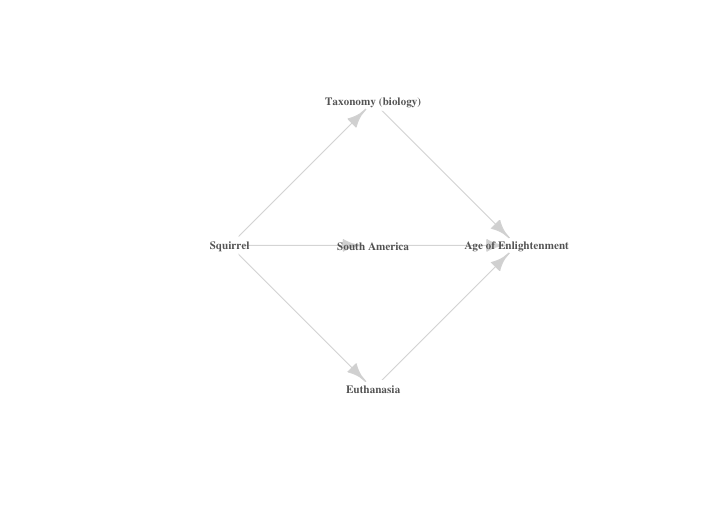

```{r setup, include=FALSE}
knitr::opts_chunk$set(echo = TRUE)
load("edges_url_dictionary.RData")
url_dictionary$name <- as.character(url_dictionary$name)
url_dictionary$url <- as.character(url_dictionary$url)
edges$From <- as.character(edges$From)
edges$from_url <- as.character(edges$from_url)
edges$to_url <- as.character(edges$to_url)
library(knitr)
```


This is the second part of my two-part series on webcrawling with R. If you havn't already, I encourage you to check out [part one](https://stefan-stein.github.io/posts/2020-01-09-webcrawling1/) to understand where the data in this post are coming from.

### In this post I cover

- How to present our scraped data as a network using the `igraph` package [@igraph].
- Understanding the degree distribution of our graph.
- How to find all the paths between two nodes on our network.
- How to create a visually appealing (at least I hope so...) representation of all those paths. For this we will make use of the `diagram` package  [@diagram].

For the second part, in short, I want to have function, say `graph_path()`, that does something like this:

```{r, eval=FALSE}
graph_path("Age of Enlightenment")
```



As you might have guessed, we will also rely on `dplyr` for data processing.
First, let's recall where we left off last time.


### Previously on web crawling with R...

Last time we had just finished crawling the 2-neighborhood of the English Wikipedia page for "Squirrel". That is, we started at the Squirrel page and visited all the other English Wikipedia pages that we could reach with no more than two clicks. We extracted the url of each page and its topic. In the end we learned that you could reach over 20,000 other pages with just two clicks! In this post, we will analyze the data we collected. We will represent the data as a network and our primary tool for analysing it will be the `igraph` [@igraph] package.

Let's briefly recap the shape in which our data was when we left off: We had

- `url_dictionary`: a two-column data frame storing the topic and the corresponding url, i.e. the first row would be "squirrel" and "https://en.wikipedia.org/wiki/Squirrel". This is the node-list of our network and we use it to keep track of the actual topics behind each url. It is also useful for keeping track of different hyperlinks resolving to the same page. For example, "wiki/Adjective", "wiki/Adjectives", "wiki/Predicate_adjective" or "wiki/Adjectival_form" all link to the page for "adjective".
- `edges`: a data frame containing the actual edge information of our network. It has four columns: `From` is the name of the topic of the outgoing edge and `from_url` its url. `to_url` is the url `From` is linking to and `To` is the topic behind that url. Currently we have only populated the first three columns and still need to populate the `To` column.


### Creating the network

The nodes of our network will be the individual Wikipedia pages and the edges will be the hyperlinks between them.
The goal is to represent our data as a *simple, directed* network. Let's recall what these two terms mean:

- A network is *simple*, if there are no self-loops and each edge appears at most once. Obviously, in our data it can (and does) happen that one page will link to another page multiple times. Rather than creating many edges between these two nodes, we will count how many times the link appears and assign it as a weight to the edge.
- A network can be *directed* or *undirected*. It is directed if an edge from *A* to *B* is not equivalent to an edge from *B* to *A* and undirected otherwise. A hyperlink network is a classical case of a directed network. Page *A* linking to page *B* does not automatically mean that *B* is also linking back to page *A*. Another typical example of a directed network is the Twitter network of who follows whom. This is opposed to the Facebook network, which in social media analysis would be a typical example for an undirected network. If *A* is friends with *B*, then *B* is automatically also friends with *A*.


Let's take a look at the data frames we have.

```{r, eval=FALSE}
head(url_dictionary)
```

```{r, echo=FALSE, layout="l-body-outset"}
kable(head(url_dictionary))
```

```{r}
nrow(url_dictionary)
```

Since different urls may point to the same web page, this is only an upper bound on the number of nodes in our network. To get the actual size of our network, we can run

```{r}
length(unique(url_dictionary$name))
```

To get the number of edges, let's first process the `edges` data frame a little.

```{r, eval=FALSE}
head(edges)
```

```{r, echo=FALSE, layout="l-body-outset"}
kable(head(edges))
```

The `url_dictionary` works like an address book for all the topics we scraped. We can use it to populate the `To` column in our `edges` data frame using a simple `left_join()`. Also notice that our `edges` data frame contains edges that point outside of the 2-neighborhood of "Squirrel": When we were scraping pages at a distance of 2 from the squirrel page, we also recorded all the outgoing edges from those pages. This was necessary to find any edges pointing back to nodes within the 2-neighborhood we were interested in. But in doing so we also recorded edges pointing out to new pages located at a distance of 3 from the squirrel page. For this project we are not interested in those edges and we remove them by dropping any rows in `edges` that still contian `NA` after the `left_join()` with `url_dictionary`.

```{r}
library(dplyr)
weighted_edges <- edges%>%left_join(url_dictionary, by = c("to_url" = "url"))%>%
  mutate(To = name)%>%
  select(-name)%>%
  filter(!is.na(To))
```

```{r, eval=FALSE}
head(weighted_edges)
```

```{r, echo=FALSE, layout="l-body-outset"}
kable(head(weighted_edges))
```

Nice! This is almost what we want to have. Right now, there are still multi-edges in this edge list. For example, "Squirrel" might link to "Eocene" several times. To summarise how many times each topic is linking to another we use `group_by()`, followed by a `filter()` to get rid of self-loops:


```{r}
weighted_edges <- edges%>%left_join(url_dictionary, by = c("to_url" = "url"))%>%
  mutate(To = name)%>%
  select(-name)%>%
  filter(!is.na(To))%>%
  group_by(From, To)%>%
  summarise(Weight = n())%>%
  ungroup()%>%
  filter(From != To)
```

```{r, eval=FALSE}
weighted_edges%>%filter(From == "Squirrel")%>%
  head()
```

```{r, echo=FALSE, layout="l-body-outset"}
kable(weighted_edges%>%filter(From == "Squirrel")%>%
  head())
```

Alright! `edges` now contains all the unique edges of our hyperlink network alongside their multiplicity. 

```{r}
nrow(weighted_edges)
```

That's over 2.5 million hyperlinks that we can click on within two-clicks of the squirrel page. We are now ready to load our network into an `igraph` object.

```{r}
library(igraph)
g <- graph_from_data_frame(weighted_edges[,1:2], directed = T)
```

We read in our data as a directed graph, which ticks the second goal we had for representing our data as a network. To check if `g` is indeed simple, we use `is.simple()`.

```{r}
is.simple(g)
```

Nice! Note that we also could have read the edge list with multi-edges and self-loops into `igraph` first and then used the `simplify()` function with the options `remove.multiple=TRUE` and `remove.loops=TRUE`. While that might have been somewhat faster, I think manual data manipulations such as those we did above can be a good exercise to make sure we understand our data properly, e.g. we precisely understand the various reasons why our graph might not be simple and know how to remove them. Anyways, without further ado, on to visualizations!

### Analyzing the degree distribution

From the last post, we already know that the "Squirrel" page has 512 outgoing connections and above we just saw that there is a total of ~2.5 million directed edges between the ~22.5 thousand nodes of our network. So some natural questions to ask would be: How are these 22.5k edges distributed amongst the nodes; is it an even spread? Is 512 outgoing edges a lot? How "important" is the squirrel to the connectivity of our network? These questions can be answered by looking at the *degree distribution* of our network. Leaving the distinction between outgoing and incoming edges aside for the moment, a look at the following histogram shows that there seems to be something going on here.

```{r}
hist(degree(g))
```

Very clearly, almost all nodes have a degree somewhere between 1 and 1000 (isolated nodes are not possible due to how the data was collected). But then, not even perceptible on the plot above, there seem to be very few nodes with very high degrees, going all the way up to 15,000. A log-log plot gives us a better idea of what's going on.

```{r}
library(ggplot2)
ggplot(mapping = aes(x = 1:15080, y = degree.distribution(g)[-1]))+
  geom_point()+
  geom_jitter()+
  scale_y_log10()+
  scale_x_log10()

```


### Visualizations

To create a visulatzation as the one in the introduction, we need to be able to find all shortest paths leading from "Squirrel" to any other given topic. In `igraph` we can find those quite easily using `all_shortest_paths()`. The output is a list of lists and the actual paths are stored in the `res` value.

```{r}
all_shortest_paths(g, from = "Squirrel", to = "Age of Enlightenment")$res
```

These are exactly the connections we saw in the introduction. Currently they are still in `igraph` format. For our visualization, we want to extract the actual vertex names, which we can achive like so.

```{r}
all_shortest_paths(g, from = "Squirrel", to = "Age of Enlightenment")$res[[1]]%>%names()
```

This will be the first building block of our function `graph_path()`.

```{r}
graph_path <- function(target){
  
  paths <- all_shortest_paths(g, "Squirrel", target)$res
  sapply(paths, names)
  
  #####
  ## Some more visualization code to be added here
  ####
  
}
```

The `tryCatch()` trhows an error if there is no path between `from` and `to`, be it because they simply are not connected or because we misspelled one of them `sapply` at the bottom gives us a matrix in which each column corresponds to one valid path.

```{r}
graph_path("Age of Enlightenment")
```

To visualize these paths, we have to lay out the nodes in the diamond shape from the introduction. We can do this using the `coordinates()` function from the `diagram` package. It allows us to arrange objects in a grid-like manner. Its `pos` argument takes a vector specifying how many objects we want in each column of our grid. In the case above this vector will be of length three, with the first and last entry equal to one (corresponding to "Squirrel" and "Age of Enlightenment"). The middel entry will be equal to the number of paths leading from "Squirrel" to "Age of Enlightenment", so in this case, 3. Setting `hor=F` ensures we get the layout above. Since the distance to any other node from "Squirrel" is either one or two, we only need to distinguish between these two cases.

```{r}
library(diagram)
graph_path <- function(target){
  
  paths <- all_shortest_paths(g, "Squirrel", target)$res
  paths_matrix <- sapply(paths, names)
  
  # If our matrix has only two rows, 
  # Squirrel must be connected to the target directly
  if(nrow(paths_matrix) == 2){
    coords = coordinates(pos = c(1,1), hor = F)
    
    #####
    ### Visualization code goes here
    #####
    
  }else{
    coords <- coordinates(pos = c(1, ncol(paths_matrix), 1), hor = F)
    
    #####
    ### Visualization code goes here
    #####
    
  }

}
```

Finally, we can plot the paths by turning `paths_matrix` into an edge list and passing `coords` as layout to the plotting function.

```{r}
graph_path <- function(target){
  
  paths <- all_shortest_paths(g, "Squirrel", target)$res
  paths_matrix <- sapply(paths, names)
  
  # If our matrix has only two rows, Squirrel must be connected to the target directly
  if(nrow(paths_matrix) == 2){
    coords = coordinates(pos = c(1,1), hor = F)
    
    plot(graph_from_edgelist(matrix(c("Squirrel", target), nrow = 1)), 
         layout=coords, vertex.shape = "none",
         vertex.label.font=2, vertex.label.color="gray40",
         vertex.label.cex=.7, edge.color="gray85")
    
  }else{
    coords <- coordinates(pos = c(1, ncol(paths_matrix), 1), hor = F)
    
    g <- graph_from_edgelist(rbind(t(paths_matrix[1:2,]), t(paths_matrix[2:3,])))
    
    plot(g, layout=coords, vertex.shape = "none",
         vertex.label.font=2, vertex.label.color="gray40",
         vertex.label.cex=.7, edge.color="gray85")
    
  }

}
```


Let's try it out.

```{r}
graph_path("Age of Enlightenment")
```


