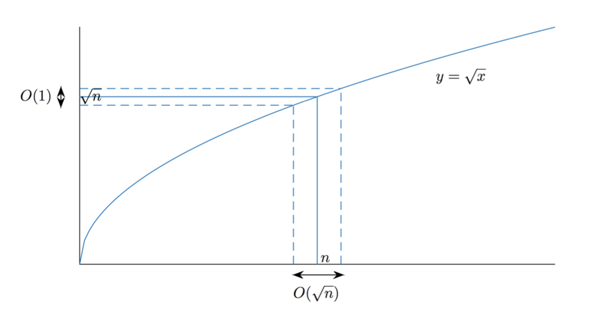

```{r setup, include=FALSE}
knitr::opts_chunk$set(echo = TRUE)
```

The probability that an $n$-dimensional standard normal vector is far away from the sphere of radius $\sqrt{n}$ decays exponentially fast. In particular, even though it has expectation zero, its realizations will be nowhere close to zero.

When I first came across this fact, I was quite surprised. It did not seem clear to me at all why this would be the case and indeed, our experience from handling low-dimensional normal distributions seems to tell us exactly the opposite: If I draw from a 1-dimensional $\mathcal{N}(0,1)$ distribution, I expect the value to be close to the origin and the "$3\sigma$-rule" tells me that the probability of observing anything that is further away than 3 from the origin is way below $1\%$. When drawing form a 2-dimensional standard normal distribution, the values will again cluster close to the origin. Why is it then, that when I draw from a $n$-dimensional standard-normal distribution, my draws will be pushed outwards and away from the origin towards infinity? Especially since the expectation of such a vector will still be equal to zero? More, even, why are they pushed outward in an almost perfect circle? As it turns out, this result is much more intuitive and logical as it might seem at first glance, which for me, makes out a lot of the beauty of it: It seems strange and unintituve at first, but after thinking about it, you have to come to the conclusion that it actually cannot be any other way.

First, let's make precise in the following theorem what I mean by "an $n$-dimensional standard normal vector will concentrate tightly around a sphere of radius $\sqrt{n}$".

 **Theorem:** *Let $X$ be a random $n$-dimensional vector with independent $\mathcal{N}(0,1)$ entries. Denote by $\Vert \; . \; \Vert_2$ the Euclidean vector norm. Then, for any $t \ge 0$,*
 \[
    P(\vert \Vert X \Vert_2 - \sqrt{n} \vert \ge t) \le 2 \exp(-c t^2),
 \]
*for some universal $c > 0$ independent of $n$.*

In other words, the probability of observing a realization of $X$ that is far away from the sphere with radius $\sqrt{n}$ decays exponentially fast with the distance from the sphere. Another way to read this theorem is: If we fix a probability $p$, say $99\%$, then with probability $p$, $X$ will stay within *constant distance* from the sphere of radius $\sqrt{n}$. Something that is not made explicit in the theorem, but holds nonetheless, is that the realizations of $X$ will also be spread evenly around the sphere of radius $\sqrt{n}$, i.e. there is not one direction in which all realizations of $X$ lie, but rather, $X$ behaves almost like the uniform distribution on said sphere.


Thus, we now have two questions we want answers to:

1. Why are high-dimensional normal vectors far away from the origin in the first place?
1. Why, with growing dimension, do they move out from the origin in an almost perfect circle?

The mathematical theory presented here is developed very nicely and in the more general context of sub-gaussian random vectors in chapter 3 of the book "High-Dimensional Probability - An Introduction with Applications in Data Science" by Ronan Vershynin, which is freely available [online](https://www.math.uci.edu/~rvershyn/papers/HDP-book/HDP-book.pdf), [@vershynin_2018]. In particular, the author states and proves above theorem in more generality as theorem 3.1.1.


## Normal distributions in low-dimensions


I denote by $\mathcal{N}(0,1)$ the distribution of a 1-dimensional standard-normal random variable. That is, a normally distributed random variable with mean zero and variance one. Whenever I speak of a "$n$-dimensional standard-normal vector", I mean a random variable that takes its values in $\mathbb{R}^n$ and has independent $\mathcal{N}(0,1)$ entries. I denote its distribution by $\mathcal{N}(0,I_n)$, where $I_n$ is the $n \times n$ identity matrix.

Probably all of us know the characteristic bell-like shape of the density of a standard-normal distribution. 

```{r, echo=FALSE}
normal_density <- dnorm(seq(-5,5, by = 0.1))
plot(seq(-5,5, by = 0.1), normal_density, type = "l",
     main = "Density of a N(0,1) distribution",
     xlab = "x")
```

We know that random draws from that distribution cluster around the origin. Indeed, if we draw from that distribution $20.000$ times and plot the corresponding histogram, we see that most draws are very close to zero.

```{r}
library(tidyverse)
set.seed(123)
normals_1d <- data.frame(x = rnorm(20000)) 
ggplot(normals_1d, aes(x)) +
  geom_histogram()
```

Checking out some summary statistics of our vector...

```{r}
summary(normals_1d)
```

... we see indeed he mean is also close to zero, as we would expect.

How about two dimensions?

```{r, preview=TRUE}
library(tidyverse)
normals_2d <- data.frame(x = rnorm(20000),
                         y = rnorm(20000))
plot_normals <- ggplot(normals_2d, aes(x=x, y=y) ) +
  stat_density_2d(aes(fill = ..level..), geom = "polygon") +
  # add this to force ggplot to make a square plot
  # otherwise dimensions will be distorted
  coord_equal() 

plot_normals
   
```

Clearly, the values still are concentrated tightly around the origin.

## High-dimensional normal distributions

So, what happens when we move to higher dimensions? Well, it is quite logical, actually: Recall that we measure the distance of an $n$-dimensional vector from the origin by calculating its Euclidean norm, that is, for $x \in \mathbb{R}^n$, the distance of $x$ from the origin is given by
\[
  \Vert x \Vert_2 = \sqrt{x_1^2 + x_2^2 + \dots + x_n^2}.
\]
If $x$ is a realization of a $n$-dimensional standard-normal random variable, each of its components $x_i$ follows a $\mathcal{N}(0,1)$ distribution. So, each component will on average be close to zero. However, when adding up the deviations from zero across all components, this will still give a large number and thus, $x$ is far away from the origin. In low dimensions, this is phenomenon is not so prominent, because there simply aren't that many small contributions to add up. Expressed differently, in high-dimensions there are simply many more directions for our vector to wiggle away from the origin. Also we can come up with a heuristic that gives us a great intuition behind our theorem: the expected *square distance* of a $n$-dimensional standard normal vector $X$ is simply the sum of the variances of the entries:
\[
  E[\Vert X \Vert_2^2] = \sum_{i=1}^n 1 = n.
\]
Thus, as a heuristic we can say, 

>if the expected square distance of our vector $X$ is equal to $n$, then the expected distance should be roughly equal to $\sqrt{n}$. 

Hence, the theorem basically just says that the length of $X$ will be concentrated tightly around its expectation.

Let's take a look at some more simulations. What happens if we go to higher dimensions, say 100?

```{r}
matrix(data = rnorm(100*20000), nrow = 20000)%>%
  apply(MARGIN = 1, function(vec) sqrt(sum(vec^2)))%>%
  as.data.frame()%>%
  setNames("Length")%>%
  ggplot(aes(Length)) +
  geom_histogram() +
  labs(title = "Distribution of the length of a 100-dimensional standard normal vector
       \nBased on 20.000 realizations")
```

We see that the bulk of the realizations are indeed centered around $10 = \sqrt{100}$, as predicted by our theorem. You might be wondering, *'hold on, but the expectation of such a vector is still zero, right? So how does that fit into this picture?'* Well, try thinking of it this way: Imagine you have a random variable that takes its values uniformly on the sphere of some radius $r > 0$. The expectation of that random variable will still be zero, but each realization of it will have length $r$ and thus be nowhere near the origin. Another way to think about it is this: For a $100$-dimensional normal distribution to take a value close to the origin, all 100 independent $\mathcal{N}(0,1)$ entries must take a value close to zero. This gets increasingly less likely as the dimension $n$ grows.

I hope this served to convince you that it makes sense that a high-dimensional standard normal vector should be far away from the origin. Remains the question: *Why is it distributed almost like a sphere?*

Again, there is an easy intuition behind that: Think of the plot of the 2-dimensional normal distribution above. We see that the realizations spread out relatively evenly in all directions and this is basically also the case in high dimensions. This can be made precise in the following lemma.

**Lemma:** Let $X$ be an $n$-dimensional standard normal random variable. Then, the random variable $\theta = X / \Vert X \Vert_2$ is distributed uniformly on the unit sphere $\mathbb{S}^{n-1}$.

*Proof:* Clearly, $\Vert \theta \Vert_2 = 1$, so $\theta$ will take values on $\mathbb{S}^{n-1}$. Let $O$ be any orthogonal matrix. Then, by the [transformation rules for normal distributions](https://en.wikipedia.org/wiki/Multivariate_normal_distribution#Affine_transformation),

\[
  OX \sim \mathcal{N}(0, OI_nO^T) = \mathcal{N}(0, I_n).
\]

But then $O\theta$ has the same distribution as $\theta$. Thus, $\theta$ is rotationally invariant and takes its values on $\mathbb{S}^{n-1}$. But there is only one such distribution, which is the uniform distribution on $\mathbb{S}^{n-1}$. &#8718;

This lemma tells us that the *direction* of a $n$-dimensional standard normal random variable $X$ is distributed uniformly in all directions. This makes sense: Each component of $X$ is independent and identically distributed, so $X$ is equally likely to wiggle into any direction.

So how does our theorem fit into this? Well, we already heuristically found out that we roughly have $E \Vert X \Vert_2 \approx \sqrt{n}$. The theorem tells us that $X$ will be close to the sphere of radius $\sqrt{n}$, $\sqrt{n}\mathbb{S}^{n-1}$. In other words, it simply says, that the actual value of $\Vert X \Vert_2$ will be close to its expectation! This sort concentration behavior of random variables taking values very close to their expectation is frequently observed for "sufficiently well-behaved" random variables. It is also one of the key properties of the family of [sub-gaussian random variables](https://en.wikipedia.org/wiki/Sub-Gaussian_distribution), which includes many common distributions and in particular all bounded random variables.

In [@vershynin_2018] we find another interpretation of this theorem (Remark 3.1.2): We know $\Vert X \Vert_2^2$ has expectation $n$ and standard deviation $O(\sqrt{n})$. This means, $\Vert X \Vert_2^2 \approx n \pm O(\sqrt{n})$ and therefore $\Vert X \Vert_2 \approx \sqrt{n \pm O(\sqrt{n})}$. However, we have
\[
  \sqrt{n \pm O(\sqrt{n})} = \sqrt{n} \pm O(1).
\]
The author illustrates this beautifully in his figure 3.2, which I borrow for this blog post:



While $\Vert X \Vert_2^2$ deviates by $O(\sqrt{n})$ around $n$, $\Vert X \Vert_2$ only deviates by a constant amount around $\sqrt{n}$.


#### Credits for the preview image

The preview image is taken from [@vershynin_2018], figure 3.2, and all rights belong to its author.

