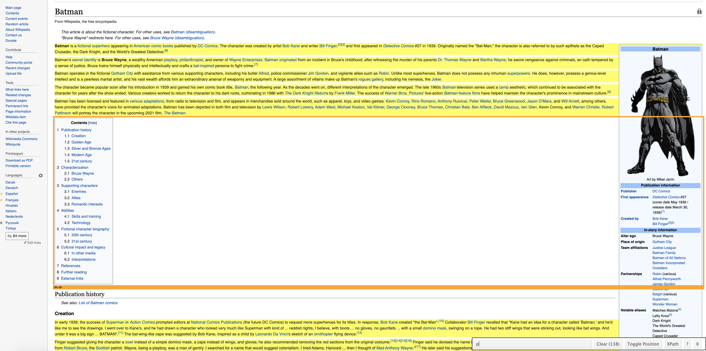
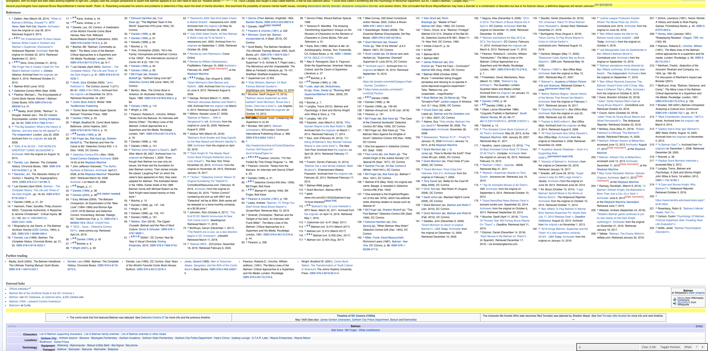

```{r setup, include=FALSE}
knitr::opts_chunk$set(echo = TRUE)
```

```{r python_setup, echo=FALSE}
# reticulate::use_condaenv("dummy_testing")
library(reticulate)
# reticulate::use_python("/anaconda3/envs/dummy_testing/bin/python")
reticulate::use_condaenv("dummy_testing")
```


I'm pretty sure nobody really needs an introduction to who Batman is, as he is probably one of the most iconic superheroes. All too iconic are also his best buddy Robin and his nemesis, the Joker. It's save to say that Batman would not be Batman without both of them in his life. So, having two such influential people in his life, it naturally (well...) begs the very important question: Whom is Batman more alike? Robin or the Joker?

Having spent some years as a PhD student, I know what to do in a situation like this: Having found a pressing question such as the above, we are going to conduct some rigorous research to get to the bottom of this! You can find the full code as a Jupyter notebook in the associated [GitHub repository](https://github.com/stefan-stein/website_similarites).

As in any good research project, we need to make sure our research question is actually well-defined. That is, first of all we need to define what it means for Batman to be *more like* the Joker or Robin. What are Batman and the other two "like"? Well, let's go full mathematician on this problem and provide a formal definition:

**Definition:** *Batman, the Joker and Robin are whatever their Wikipedia pages say they are.*

At this point you might get a hunch that this project might not be entirely suitable for peer reviewed publication. But even though the project at hand is more of a fun little pastime, the techniques we are going to use are very useful for more serious research endeavors.

The definition above gives us an idea about what is to be done next: First, we want to obtain a copy of the Wikipedia pages for Batman, Robin and the Joker. Then, we somehow have to define a measure of similarity between pages. Mathematically speaking, we need to find a [metric](https://en.wikipedia.org/wiki/Metric_(mathematics)) $d$ on the space of websites $\mathcal{W}$, that allows us to measure how close two websites are to one another. Mathematically, the space of websites is just some very large, finite set without any inherent structure. Hence, it will be difficult to define any meaningful metric on that space itself. Instead, we will find a map $\varphi: \mathcal{W} \rightarrow \mathbb{R}^n$, for some potentially large $n$, which, given a website, returns a numerical representation of that website as some high-dimensional vector, that captures "the essence" (I am deliberately vague about this here) of the website. We then choose an appropriate metric $d$ on $\mathbb{R}^n \times \mathbb{R}^n$ and measure the distance between two websites $A$ and $B$ as $d(\varphi(A), \varphi(B))$. What do we gain from this? Well, there are plenty of metrics and associated similarity measures on $\mathbb{R}^{n}$ to choose from with well understood, desirable properties.

Wherever there is something to be gained from a simplification like this, there is a price to be paid, too. In our case it is that the map $d(\varphi(.), \varphi(.)): \mathcal{W} \times \mathcal{W} \rightarrow \mathbb{R}$ actually no longer needs to be a metric, as $\varphi$ need not be an embedding; i.e. two different websites could have the same numerical representation as an $n$-dimensional vector under $\varphi$. Especially for the embeddings we are going to use, which are based on word frequencies, this will be the case. It seems a reasonable price to pay, though, as we might heuristically assume that websites that use exactly the same words at the same frequency are "essentially" the same, too - although this can be a huge fallacy in more serious applications. For the sake of our small project at hand, we will go with it.

Let's make a list of the things we need to do.

**To-Do List:**

1. Download the HTML of the Wikipedia pages for Batman, Robin and the Joker.
1. Pre-process the HTML: Get rid of all the tags, sidebars etc. so that only the actual page content remains.
1. For each website, find some representation as a high-dimensional vector in $\mathbb{R}^n$, where $n$ is the same for all websites.
1. Calculate the similarities between these vectors.

The first two points are concerned with data wrangling. In a machine learning context, the third step is the "learning step", in which we learn numerical representations of our websites. This is actually the tricky part. Here any technique for document representation can be used. We will focus on a purely frequency-based approach, that is, in a nutshell, we will calculate which word appears how often in which document and weigh this frequency by the importance of the word. This will give us a long vector for each document and in the last step we then simply compare how these vectors are. This technique is part of the family of *term-frequency-inverse-document-frequency* (tf-idf) approaches and the details are given below. In particular, there is no actual "learning" involved in this approach as semantics and order of the text are not taken into account. In machine learning language, these representations are often called "document embeddings", although it is to be noted, that they are **not** embeddings in the mathematical sense of injective maps, as reordering of words will result in the same numerical representation. 


# Getting ourselves a Batman

The first item on our agenda is to obtain a copy of the Wikipedia pages of Batman, Robin and the Joker. In Python, the `requests` library allows us to do just that. Its use for obtaining the HTML from a website is fairly straightforward. For example, we can obtain the content of the page for Batman, which is located at [https://en.wikipedia.org/wiki/Batman](https://en.wikipedia.org/wiki/Batman), like so:

```{python}
import requests
url = 'https://en.wikipedia.org/wiki/Batman'
batman = requests.get(url).text
print(batman[:2000])
```

The `requests.get(url)` gets the content that is located at the specified URL for us. The returned object contains quite a bit more information than only the content located at the URL and to get to the actual HTML we use `requests.get(url).text`. If you are familiar with the structure of HTML or maybe even have read my previous blog posts on web-crawling ([here](https://stefan-stein.github.io/posts/2020-01-09-webcrawling1/) and [here](https://stefan-stein.github.io/posts/2020-02-09-webcrawling2/)), then it will come at no surprise that out `batman` object currently is still looking pretty messy: There are HTML tags all over the place and there is all sorts of information that is not part of the actual Wikipedia article. Luckily for us, there is the [`BeautifulSoup`](https://www.crummy.com/software/BeautifulSoup/bs4/doc/) Python library specifically designed for obtaining information from HTML and XML files. Its documentation is pretty neat and the syntax needed is quite straightforward. Calling the `BeautifulSoup()` function on our `batman` returns a `BeautifulSoup` object, from which we can easily extract the parts of the HTML we are interested in. In the function call of `BeautifulSoup()` we need to specify how we want to parse the HTML by supplying the name of an HTML parser as a string. In this case we are using the `'lxml'` parser, which, according to the documentation is "very fast and lenient", when it comes to parsing HTML. You might have to install `lxml` before using it by running

```{bash, eval=FALSE}
$ pip install lxml
```

from the terminal. See the [BeautifulSoup documentation](https://www.crummy.com/software/BeautifulSoup/bs4/doc/#installing-a-parser) for details. Once we have turned `batman` into `soup`, we can print the HTML using the `prettify()` function, which will take care of indentation and make the output more readable.


```{python}
from bs4 import BeautifulSoup
soup = BeautifulSoup(batman, 'lxml')
print(soup.prettify()[:2000])
```

As we can see, the actual HTML content is still the same. The difference is, that Python now "understands" that this is HTML and not just one long messy string. In consequence, we can now quickly extract those parts of the HTML we are interested in. Before we can do that, though, we first need to find out where in the HTML the relevant information is located. The very easy to use [SelectorGadget](https://selectorgadget.com/) Chrome extension is a great tool for this purpose. Simply by clicking on the sections of the website we want to extract, it will tell us for which CSS selector or HTML tag we need to filter our `soup` object. In our case, for example, we want all the content of the actual article, but not any of the sidebars/ header section of the page. It took me a bit of playing around to find that the solution in this case is quiet simple: All the relevant information to the task at hand is included in the paragraph (`<p>`) tags of the HTML.

Everything highlighted in yellow will be selected by filtering for the `<p>` tag. The parts in white will be discarded.



If you are familiar with typical web page design, filtering for the `body` content of the page might seem like the more obvious initial choice. In that case, however, the sections References, Further Reading, External Links, in short: all the stuff at the bottom of the Wikipedia page, would also have been selected. When calculating the word frequencies later on, this would have disproportionally blown up the size of our wordlists as these sections contain hundreds of words and some words only appear here and nowhere else on the page. This would have distorted the word frequencies and associated word importances. When only filtering for `<p>` tags, these bottom sections of the page are excluded, as can be seen from the following screenshot.



In BeautifulSoup, we can use the `find_all` method to extract the content of all the `<p>` tags. This will return a list with one entry for each paragraph, which we then can join back together into a single string using a list comprehension and `join()`.

```{python}
content = soup.findAll('p')
content = " ".join([paragraph.get_text() for paragraph in content])
content[:70]
```

This is much better and the actual text is discernible. It is not yet exactly what we want, though, as there are still plenty of newline characters (`\n`) or unwanted numbers and parenthesis, which we will deal with in the next section. Using only paragraphs actually excludes all the headings. We might argue, though, that this is justified, as the headings should only reflect content of the subsequent paragraph anyways.

# Tokenization and Lemmatization

Aside from getting rid of the last stray unwanted characters, to be able to process this text and count word frequencies, we will have to break the text apart into single words. Machine Learners call this "tokenization".

Also, words can appear in [*inflected forms*](https://en.wikipedia.org/wiki/Inflection), that is, a word can be modified to reflect tense, case or gender. For example, "be", "is", "was", are all forms of the same verb, "to be", but each has been modified to reflect the tense in which it is being used. It can also happen that words are being used in a derivative form such as "democracy", "democratic" and "democratization". It would make sense, though, for calculating word frequencies to count all of them as the same word. Reducing these words to a single word is called [*lemmatisation*](https://en.wikipedia.org/wiki/Lemmatisation) and [*stemming*](https://en.wikipedia.org/wiki/Stemming) in linguistics. Also, there are plenty of words that do not carry any relevant information for us, such as "to", "and", "or", "the". These are called *stopwords* and we want to get rid of them before calculating our word frequencies.

While we could probably achieve tokenization with some regex magic, lemmatization and word stemming would be much harder to program from scratch, not to mention the tedious task of coming up with an exhaustive list of all the stopwords we want to remove. Again, luckily, there is a Python library out there dedicated to precisely such tasks: The famous [Natural Language Toolkit, NLTK](https://www.nltk.org). After installing NLTK, you will have to download the list of stopwords and word stemmer separately. You can do so directly from within Jupyter Notebook by running

```{python, eval=FALSE}
import nltk
nltk.download('stopwords')
nltk.download('wordnet')
```

In the following code snippet we import NLTK and initialize our word lemmatizer (`wnl`), word stemmer (`sno`), word tokenizer (`word_tokenizer`) and our list of stopwords (`stop_words`).

```{python}
# tokenize and clean the text
import nltk
from nltk.stem import WordNetLemmatizer, SnowballStemmer
from collections import Counter
from nltk.corpus import stopwords
from nltk import word_tokenize
from nltk.tokenize import RegexpTokenizer
# tokenize anything that is not a number and not a symbol
word_tokenizer = RegexpTokenizer(r'[^\d\W]+')

sno = SnowballStemmer('english')
wnl = WordNetLemmatizer()
# get our list of stop_words
stop_words = set(stopwords.words('english')) 
```

The list of stopwords contains common English words that do not carry any additional information:

```{python}
print(list(stop_words)[:10])
```

Depending on the context, there might be some application specific words that we want to add to the list of stop words to exclude them from the analysis. In our case, for example, we can expect that the words "Gotham" or "comic" will appear in all three articles and they actually do not tell us much about who is more likely to whom. If we leave them in and, say, for some reason the word "Gotham" appears much more often in the articles about Batman and the Joker than in the article about Robin, this would indicate to our frequency based similarity measure that Batman and Joker are more similar to one another than to Robin. This might be a distortion of the true likeness between the three, though, as we would assume that "Gotham" appears in all three of the articles 
and does not actually tell us anything about them as a character. The different observed frequencies might simply be due to differing article lengths.

We can easily add custom stopwords like so:

```{python}
stop_words |= {'gotham', 'comic'}
```

One could argue about whether these are all the words that should be excluded. Also, there are other ways of ignoring words that appear in all documents, see below. The point is, if you have specific words you want to add to your own stopwords list, this is how you do it.

Now, onto the actual cleaning of the text. Currently, we have the `content` object which is one long string with the content of the Wikipedia page. I am a big fan of Python list comprehensions, as they allow for clean, powerful and concise code. Much the same way that `lapply()` makes many for-loops redundant in $\mathsf{R}$, list comprehensions let us collapse for-loops into a single line of code in Python. Therefore, we will now build up two list comprehensions that will take care of data cleaning for us. The first takes our messy `content` and returns a lemmatized version of it. The second one takes the lemmatized text and stems the words into their root form, using our word stemmer `sno`, returning a cleaned word list. Let's go step by step.

First, we want to break this string up into single words, so the first building block is:

```{python, eval=FALSE}
[w for w in word_tokenizer.tokenize(content)]
```


Then, we want to make sure that these words `w` are actual words and discard any special characters or numbers, i.e. want to check that `w.is.alpha() == True`. Secondly, we want to make sure, `w` is not one of our stopwords. Thus, we add to our list comprehension:

```{python, eval=FALSE}
[w for w in word_tokenizer.tokenize(content) if \
                w.isalpha() and w not in stop_words ]]
```

Next, is lemmatization:

```{python}
lemm_txt = [ wnl.lemmatize(wnl.lemmatize(w.lower(),'n'),'v') \
                for w in word_tokenizer.tokenize(content) if \
                w.isalpha() and w not in stop_words ]
```

Finally, we add the word stemming. We also add another condition to only include such words that are at least three characters long, as we want to get rid of any accidentally created trailing words in our list (there are, of course, plenty of proper English words with only two characters, but these usually do not carry any relevant information, such as "to", "or", "me" etc.).

```{python}
[ sno.stem(w) for w in lemm_txt if w not in stop_words and len(w) > 2 ][:5]
```

This looks about right! We can now wrap all of the text cleaning into a single function.

```{python}
def clean_text(txt):
    lemm_txt = [ wnl.lemmatize(wnl.lemmatize(w.lower(),'n'),'v') \
                for w in word_tokenizer.tokenize(txt) if \
                w.isalpha() and w not in stop_words ]
    return [ sno.stem(w) for w in lemm_txt if w not in stop_words and len(w) > 2 ]
```

With this function and the code snippets from the previous section, we can also define a function `get_website()`, that, when given the name of our superhero/ villain, will retrieve and pre-process its Wikipedia page.

```{python}
def get_website(subject):
    url = 'https://en.wikipedia.org/wiki/' + subject
    r_subject = requests.get(url).text
    soup = BeautifulSoup(r_subject, 'lxml')
    content = soup.findAll('p')
    content = " ".join([paragraph.get_text() for paragraph in content])
    return clean_text(content)
```

Getting the website content for our three characters, now is just - you guessed it - a single list comprehension away.

```{python}
heroes = ['Batman', 'Robin_(character)', 'Joker_(character)']
hero_websites = [get_website(hero) for hero in heroes]
```

Let's take a look at Robin, say,

```{python}
hero_websites[1][:20]
```

Alright! These lists still contain duplicates. So what we want to do next is count which word appears how many times in each website. That is, for each character we want to create a dictionary of with entries of the form "`word : frequency`". This is called a [bag-of-words model](https://en.wikipedia.org/wiki/Bag-of-words_model). The `Counter` function from the `collections` Python library does exactly that. We will have to print quite a few dictionaries further down, so I introduce a helper function here, that allows for prettier printing of dictionaries. `print_sorted()` will sort a dictionary based on its values, i.e. the word frequencies in our case, and print the top `number` entries (10 by default). Let's try this for the Joker.

```{python}
from collections import Counter

# useful function to print a dictionary sorted by value (largest first by default)
def print_sorted(d, ascending=False, number = 10):
    factor = 1 if ascending else -1
    sorted_list = sorted(d.items(), key=lambda v: factor*v[1])
    for i, v in sorted_list[:number]:
        print("{}: {:.3f}".format(i, v))

print_sorted(Counter(hero_websites[2]))
```

Looks about right. To end this section, let's get some summary statistics for each hero: How many and how many unique words does each of their websites contain?

```{python}
for i in range(len(heroes)):
    print('Size of {} website: {} words and {} unique words'.format(heroes[i], 
                                                                    len(hero_websites[i]), 
                                                                    len(Counter(hero_websites[i]))))
```


# Term frequencies and inverse document frequencies

We see that both in terms of overall size as well as number of unique words, the websites differ quite substantially. Therefore, we need to assign each word its character-specific weight. Otherwise, if we assigned the word "Batman", say, the same weight for all characters, then the Joker might seem much more like Batman, simply because their websites are longer and thus have more occurrences of the word "Batman". The "term frequency, inverse document frequency"-approaches, or "tf-idf"-approaches for short, do just that. The exact formulas differ and are up to personal preference, but the basic idea is always the following: We have a bag-of-words dictionary for each website, as well as a dictionary of how often words appear in all of the websites together. For each word $w$ in each document $d$ we now calculate the *term frequency*, ${\rm tf}(w,d)$, which measures how often $w$ appears in $d$. Again, there are different formulas for doing this, but the general idea is, that ${\rm tf}(w,d)$ measures how important $w$ is for $d$. Next, we calculate the *inverse document frequency*, ${\rm idf}(w)$, for each word $w$. The general idea of $\rm idf$ is that we count how many documents contain the word $w$, call this $\text{df}_w$, and then take $\text{idf}(w)$ to be some transformation of $N/\text{df}_w$, where $N$ is the total number of documents we have. That is, if $w$ appears in many of the documents, $\text{idf}(w)$ will be small, signaling that $w$ is not not a very distinctive word. If, on the other hand, $w$ appears only in very few documents or is unique to a specific document, $\text{idf}(w)$ will be large, signaling that containing $w$ is a distinctive feature for a document.

Once we have computed $\text{tf}(w,d)$ for each word $w$ and document $d$ and $\text{idf}(w)$ for each word $w$, we calculate the vector representation of $d$ as the vector with entries
\[
  v_d = (\text{tf}(w,d) \cdot \text{idf}(w))_{w \in \mathcal{C}},
\]
where $\mathcal{C}$ is our *corpus*, i.e. all the unique words of all documents. This means, the dimension of our representation space for the documents is $c = \vert \mathcal{C} \vert$, i.e. we represent each document $d$ as a vector in $\mathbb{R}^c$. Notice a few things

1. The dimension $c$ is the same for all documents. Otherwise we would not be able to calculate similarities between document representations.
1. For most documents, the dimension $c$ will be strictly larger than the number of unique words in each document, i.e. there will be words in $\mathcal{C}$ that don't appear in $d$ and by default we set their entries in $v_d$ to zero.
1. In our notation above we implicitly assume that there is a fixed ordering to our words in $\mathcal{C}$, such that the $k$-th entry of $v_d$ will always correspond to the same word $w$ for all documents $d$.

We will need to make sure that the last two points are reflected in our code.
Let's get into the actual maths and code!

## Computing idf

Given our list of bag-of-words for each DC character, we want to compute for each word $w$, the inverse-document-frequency, or ${\rm idf}(w)$. This can be done in a few steps:

1. Gather a set of all the words in all the bag-of-words (recall the union operator `|` from before which will come in handy here).
2. Loop over each word $w$, and compute ${\rm df}_w$, the number of documents in which this word appears at least once:
\[
  \text{df}_w = \sum_{i = 1}^N I(w \in d_i),
\]
where $N$ is the number of documents we have and $I$ is the indicator function.
3. After computing ${\rm df}_w$, we can compute ${\rm idf}(w)$. There are usually two possibilities, the simplest one is 
$${\rm idf}(w)=\frac{N}{{\rm df}_w}.$$
Frequently, a logarithm term is added for stabilization
$${\rm idf}(w)=\log\frac{N}{{\rm df}_w}.$$
One possible issue with using the logarithm is that when ${\rm df}_w = N$, ${\rm idf}(w)=0$, indicating that words common to all documents would be ignored, which can be undesirable depending on the context. If we don't want this behavior, we can define ${\rm idf}(w)=\log\left(1+N/{\rm df}_w\right)$ or ${\rm idf}(w)=1+\log\left(N/{\rm df}_w\right)$ instead. In our case we only have three documents in total, so censoring out all the words that appear in all three of them might be throwing away a lot of information, which is why we add the $+1$ shift in our calculations.

In the following, we define a function called `get_idf(corpus, include_log=True)` that computes ${\rm idf}(w)$ for all the words in a corpus, where `corpus` for us is a processed list of bag-of-words (stemmed and lemmatized). The optional parameter `include_log` includes the logarithm in the computation.

```{python}
# compute idf
from math import log
from collections import defaultdict

def get_idf(corpus, include_log=True):
    N = len(corpus)
    freq = defaultdict(int)
    words = set()
    for c in corpus:
        words |= set(c)
        
    for w in words:
        freq[w] = sum([ w in c for c in corpus])

    if include_log:
        return { w:1 + log(N/freq[w]) for w in freq }
    else:
        return { w:N/freq[w] for w in freq }
```

Let's go through this code line by line: The argument `corpus` will be the list of bag-of-words for each document. We set `N` to be the length of `corpus`, i.e. the number of documents we have. Then, we initialize a dictionary `freq`, which for each word `w` will store in how many documents `w` appears. Notice the use of `defaultdict` here, which will become important later. The first for-loop creates a set with all the unique words in all documents. The second for-loop iterates over each word `w` in our set of unique words, `words`: The expression "`w in c`" evaluates to `True` if `w` appears in the document `c` and `False` otherwise, i.e. we are counting in how many documents `w` appears. Finally, a dictionary of inverse document frequencies is returned.

```{python}
idf = get_idf(hero_websites)
```


## Computing tf

Below we will compute ${\rm tf}(w,d)$, or the term frequency for each word $w$, and each document $d$. 
There are multiple definitions for ${\rm tf}(w,d)$, the simplest one is

$$
{\rm tf}(w,d)=\frac{f_{w,d}}{a_d}
$$

where $f_{w,d}$ is the number of occurrence of the word $w$ in the document $d$, and $a_d$ the average occurrence of all the words in that document for normalization. Just like ${\rm idf}(w)$, a logarithm can be added

$$
{\rm tf}(w,d)=\begin{cases}
\frac{1+\log f_{w,d}}{1+\log a_d} & f_{w,d} > 0, \\
0 & f_{w,d} = 0. \\
\end{cases}
$$

We implement the function `get_tf(txt, include_log=True)` that computes ${\rm tf}(w,d)$ for each word in the document. The function also includes the optional parameter `include_log` that enables the additional logarithm term in the computation. The code is rather straightforward. For better readability, we introduce the helper function `_tf()` that does the actual computation. 

```{python}
import numpy as np
from math import *

def _tf(freq, avg, include_log=True):
    if include_log:
        return 0 if freq == 0 else (1+log(freq))/(1+log(avg))
    else:
        return freq/avg

def get_tf(txt, include_log=True):
    freq = Counter(txt)
    avg = np.mean(list(freq.values()))
    tf = {w:_tf(f,avg, include_log) for w,f in freq.items()}
    return defaultdict(int, tf)
```

Given a word frequency and an average word frequency, the function `_tf` returns the value for $\text{tf}(w,d)$. The function `get_tf()` takes our document (`txt`), calculates the frequencies of each word (`Counter(txt)`) and the average word frequency (`avg`). It then creates a dictionary with the unique words as values and their $\text{tf}(w,d)$ values as keys. Again, note the use of `defaultdict` here, which will come into play in the next step.

For now, we can get the term frequencies for each document using another simple list comprehension.

```{python}
tfs = [ get_tf(c) for c in hero_websites ]
```

Let's take a look what this returns, for example for our Batman page.

```{python}
print_sorted(tfs[0])
```

Nice! This is what we would expect. The words "batman", "wayn" (stemmed form of "Wayne") and "bruce" appear most frequently.

Now we have all the components to calculate the tf-idf vector for each document: Given the dictionary of term frequencies for a document, `tf`, and the dictionary of inverse document frequencies, `idf`, we just need to calculate `tf[w]*idf[w]` for each word `w` in `idf`. It is important to keep in mind that we have to iterate over all words in `idf`: `idf` contains all the words in all documents, while `tf` only contains those words specific to the document at hand. Recall that we want to represent each document as a numeric vector *of the same dimension* and that dimension will be the size of our corpus $\mathcal{C}$, which is precisely the length of the dictionary `idf`. So naturally there will be words contained in `idf` that do not appear in `tf`. Thus, when calculating the tf-idf vector we need to add zero-padding for words that do not appear in our document. Say, `w` is one such word. Had we initialized our `tf` as a regular dictionary, trying to call `tf[w]` would throw an error. This is precisely why we initialized our `tf` as an instance of `defaultdict(int)`. When a `defaultdict` is called with a key that is currently not stored in it, it will automatically initialize this key with a default value. Since we specified `defaultdict(int)`, this default value will be zero.

The final code is now a simple one liner.

```{python}

def get_vector(tf, idf):
    # idf is longer (dict for all words in all documents), hence iterate over idf
    return np.array([ tf[w]*idf[w] for w in idf ])
```

Now, we can easily calculate the tf-idf vector for each document. Let's also make sure that indeed, all vectors have the same dimension.

```{python}

doc_vectors = [ get_vector(tf, idf) for tf in tfs ]

for v in doc_vectors:
    print(len(v))
```

Nice! Exactly as desired.

# Similarity measures

Given two numeric representation vectors $u, v \in \mathbb{R}^c$ with components $u_i$ and $v_i, i = 1, \dots, c$ respectively, corresponding to two documents, we want to compute a similarity metric. A commonly used similarity metric is the so-called [*Jaccard similarity*](https://en.wikipedia.org/wiki/Jaccard_index). It is defined as follows.

$$
{\rm Sim}_{\rm Jaccard} = \frac{\sum_i \min\{u_i, v_i\}}{\sum_i \max\{u_i, v_i\}}.
$$

Implementing this function is a short one-liner.

```{python}
# Jaccard similarity

def sim_jac(u,v):
    return sum(np.minimum(u,v))/sum(np.maximum(u,v))
```

Now we can calculate the similarity matrices between our three superheroes/ villains.

```{python}
# compute all the pairwise similarity metrics
size = len(doc_vectors)
matrix_jac = np.zeros((size,size))

for i in range(size):
    for j in range(size):
        u = doc_vectors[i]
        v = doc_vectors[j]
        matrix_jac[i][j] = sim_jac(u,v)
        
```

So, what did we get? To get a pretty representation of the similarity matrix, we can plot a heatmap of the obtained similarity scores. The code is adapted directly from the official [matplotlib website](https://matplotlib.org/3.1.1/gallery/images_contours_and_fields/image_annotated_heatmap.html).

```{python heatmap, echo=FALSE}
# Heatmap
# cf. here: https://matplotlib.org/3.1.1/gallery/images_contours_and_fields/image_annotated_heatmap.html

import numpy as np
import matplotlib
import matplotlib.pyplot as plt

plot_matrix = np.round(matrix_jac, 2)

fig, ax = plt.subplots(figsize = (10,10))
im = ax.imshow(plot_matrix)

# We want to show all ticks...
ax.set_xticks(np.arange(len(heroes)))
ax.set_yticks(np.arange(len(heroes)))
# ... and label them with the respective list entries
ax.set_xticklabels(['Batman', 'Robin', 'Joker'])
ax.set_yticklabels(['Batman', 'Robin', 'Joker'])

# Rotate the tick labels and set their alignment.
plt.setp(ax.get_xticklabels(), rotation=45, ha="right",
         rotation_mode="anchor")

# Loop over data dimensions and create text annotations.
for i in range(len(heroes)):
    for j in range(len(heroes)):
        text = ax.text(j, i, plot_matrix[i, j],
                       ha="center", va="center", color="w")

ax.set_title("Hero cosine similarities based tf-idf")

plt.show()
```


So, finally, what is the answer to our research question "Is Batman more like the Joker or more like Robin?"? The (shocking!) truth is: Batman is more like the Joker! Oh dear... can you imagine the headlines when this gets out into the world? Our favorite and iconic superhero being lumped in together with one of the most notorious villains of all times?

On a more serious note, we see that while the similarity is greatest between Batman and Joker, with a value of $0.24$ it is still not all that great. Also, it is debatable whether the vector representations of the websites are the best possible. There might be a greater likeness between the Batman page and the Joker page, simply because they are longer than the Robin page and important words thus appear more often on them. Also, the tf-idf approach only takes word frequencies into account, not word ordering or semantics. Since the stories of the Joker and Batman are very entwined, it makes sense that a lot of the same words or accounts of important events would appear in both pages. But just using the same words, does not yet mean that the meaning of the resulting sentences are actually the same. Although there are these obvious shortcomings for our particular use-case, the techniques discussed are widely used in the ML and NLP community and have quite a few merits. Should you ever want to create your own project of this type, I would be happy if the code provided could serve you as an inspiration. All in all, I hope you enjoyed this post and thanks for reading until here!

Have comments or suggestions? Let me know!


#### Credits for the preview image

Lego is owned by The Lego Group. I am not associated with The Lego Group in any way and do not own the image used. I do not have any financial gains from using this image.


