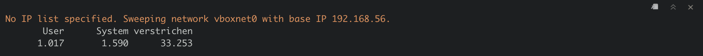

```{r setup, include=FALSE}
knitr::opts_chunk$set(echo = TRUE)
knitr::opts_chunk$set(cache = TRUE)
```


# Being a hackR

Truth be told, I cannot think of too many reasons *why* you would want to build an IP sweeper, or any half-serious infosec tool, for that matter, with R. There is an abundance of tools out there (e.g. the infamous [nmap](https://nmap.org), [`arp-scan`](https://linux.die.net/man/1/arp-scan) or [`netdiscover`](https://github.com/alexxy/netdiscover), just to name a few) that are much faster and provide much richer information than what we will build here.

The reason why I wanted to do this project nonetheless is simply to see if I *could* - and the answer turned out to be "yes". At the end of this post, we will have built a functioning IP sweeper. It won't be fast and it won't be very useful for most practical purposes, but it will do what it is supposed to, which is give you a list of all the other devices connected to the network you are on. For me, this project has been a nice learning experience about R programming and computer networking and I hope this post will bring you value, too. The code is written for Mac (and also works for Linux). For Windows, the regular expressions need to be tweaked slightly, but the code overall is very similar.

The code used in this post can be found in the corresponding GitHub [repository](https://github.com/stefan-stein/networking_R). That repository also contains code for a port-scanner written in R, to which I will dedicate a blog post in the future.

# Disclaimer

Please be aware that the resources in this blog post are provided for educational purposes only. Don't use them for anything illegal! Only sweep networks you own or have explicit permission to sweep. If you get in trouble for using the code presented here in an illicit manner, it is not my problem.

# Finding other machines on your network

Our strategy will be quite simple: We will simply try to connect to all [*Internet Protocol (IP) addresses*](https://en.wikipedia.org/wiki/IP_address) on our network and see for which IPs we get a response. If we get a response, we then will know that there must be a device or service located at that IP address. If we do not get a response, we will conclude that there is no device located at that IP. That's it. 

There is a slight problem with that reasoning, though, that we should keep in mind. When we try to connect to another machine, we will send it a [`ping`](https://en.wikipedia.org/wiki/Ping_(networking_utility)). Depending on the firewall setting of the machine it can either

- allow the connection, in which case we know that there is a machine at that IP address and it is open to receive packets, or,
- actively block the connection, in which case we know that there is a machine there, but it is blocking attempts to connect to it, or,
- do nothing and wait until the ping times out.

In the last case, which for example is used on newer Windows machines with active firewall by default, we have no way of distinguishing between an unoccupied IP address and a machine that simply ignores us. Firewall evasion is a whole science unto itself and a very rapidly changing field. So we will not worry about this for this blog post and simply assume that IPs from which we do not get a response are unoccupied. In the later part of the post, when we try out our IP sweeper, we will switch off the firewall on our target machine for demonstration purposes. While this obviously is not a very realistic setting in the real world, I think it's accaptable when we only want to understand the general concept of IP sweepers.

In summary, the ingredients we need for our project are:

- Our own IP address,
- The network identifier and subnetmask (this will allow us to calculate the list of available IP addresses on the network),
- A way of connecting to IP addresses.

# IP addresses

We will focus on [IPv4 addresses](https://en.wikipedia.org/wiki/IPv4#Addressing) and when referring to IP addresses I implicitly mean IPv4. An IPv4 address oncists of four bytes or 32 bits and usually is denoted in the [dot-decimal notation](https://en.wikipedia.org/wiki/Dot-decimal_notation). That means, it looks something like this:

$$
192.168.56.1
$$

Put simply, an IPv4 address consists of four numbers between $0$ and $255$, written next to each other, separated by a period. Each of these numbers corresponds to one byte whose value has been written out in decimal notation rather than binary notation, which allows for a more compact way of writing. 

A quick calculation shows that there only are $2^{32} \approx 4.3 \times 10^9$ IPv4 addresses in the whole world - way too few to assign a unique IP address to every device connected to the internet. To remedy this, people came up with IPv6, which with 128 bit long addresses has an address space of $2^{128} \approx 3.4 \times 10^{38}$, which are more addresses than we could ever need.

Still, IPv4 addresses did not abruptly disappear as one might expect. Instead, people used another workaround that allowed IPv4 to be continued to be used: The distinction between private and public IP addresses.

Say, I have connected with my computing device to my home WIFI. My home WIFI and all the devices connected to it form one network. When my device wants to talk to a machine on a different network (such as a server hosting a website), my device sends the message it wants to transmit to the so-called *default gateway* for talking to the outside world (usually located inside little blinking box commonly called *router*). That is a particular router on my network that has an interface to other networks (“the outside world”) and its address was told to my computer when it first logged onto the network. In fact, every device on my network sends its requests with the outside world through that default gateway and the outside world sends all its replies back to that default gateway which then distributes it to the correct machines on my WIFI network. That means, for the outside world, it does not matter which devices are sitting on my network. All it needs to know is how to reach my default gateway, which then takes care of the rest. For that purpose, the default gateway has two interfaces, each with its own IP address. Let's call them the "inwards facing IP address", known to the devices on my network and the "outwards facing IP address" known to the outside world. The outwards facing IP address has to be unique, so that traffic can be sent correctly back to the machines on my network. The inward facing IP address on the other hand can be used in other networks, too! Simply because these inward facing addresses are only used to communicate within my local network. If somebody else, far away, uses the same local IP addresses in their network, it has no effect on me using them. These local addresses are never used to talk to the outside world. In fact, if you check your device's IP address while connected to your home network, it will most likely start with $192.168.$, as this is the type of IP address typically assigned to home networks.

Therefore, sharing your private IP (the one starting with $192.168.$) won't tell others anything about you other than the fact that you are probably using a standard home network. The public or outwards facing IP of your router does reveal a lot about your location, however, as it is a unique identifier for your home network. When police in movies talk about "tracking down IP addresses", they are referring to these public IPs.

## Finding your IP address

To check your device's (private/ inward facing) IP address on a Mac, simply hold down the option (alt) key and click on the wifi symbol in the top right corner of your status bar. It will display all sorts of information about your current WIFI connection including:

- IP-address: The address of your device on the network,
- Router: The address of the default gateway.

You can also find your address via the terminal (this also works on Linux). Open the terminal and type

```{bash, eval=FALSE}
ifconfig
```

Depending on how many networks your computer is connected to, this might result in a lengthy list. Usually you are interested in the WIFI network located at `en0`, which should be located at the top of the list. You can also run


```{bash, eval=FALSE}
ifconfig en0
```

To only display the information about the `en0` network. Look for the line starting with `inet`. The IP address following is the IP address of your computer.

On Windows, open the comand prompt (search for `cmd` if unsure how to find it) and type


```{bash, eval=FALSE}
ipconfig
```

The line starting with "IPv4 address" contains your computer's IP address.

## Available IP addresses on a network

The next question we need to answer is, which IP addresses are available on the network we are connected to. Obviously it cannot be all $2^{32}$ and indeed, it usually are way fewer than that. The answer to that question is given by the [`subnetmask`](https://en.wikipedia.org/wiki/Subnetwork). It has the same format as an IP address and its value is located on the same line of the output of `ifconfig` (Mac, Linux) or on the line starting with `subnetmask` on Windows. For home networks, it usually is $255.255.255.0$. The value of the subnetmask tells us how many leading bits of the 32 bits of the IP addresses are "blocked" and how many are available to be used for the assignment of IP addresses. This is easiest understood if we convert the dot-decimal notation of the subnet mask back to binary notation. 

Suppose we our machine has IP address $192.168.56.3$ and we found out that the subnet mask is $255.255.255.0$. Turning it into binary representation gives us:

$$
11111111.11111111.11111111.0
$$

We see that there are 24 ones in that representation. That means, the first 24 bits of the IP space are fixed. The first 24 bits of our computer's IP address are (back in dot-decimal notation): $192.168.56.$ The subnetmask of $255.255.255.0$ now tells us that every device connected to our network will have these exact same first 24 bits. Only the last 8 bits may vary between IP addresses. Since 8 bits allow for 256 different numbers, there can only be at most 256 different IP addresses assigned in our network. On top of that, the very first and last IP address in the available range, in this case `192.168.56.0` and `192.168.56.255` are reserved as the network identifier and the broadcast address respectively and are never assigned to any devices on the network. Still, this leaves us with 254 usable IP addresses, which is plenty for most private purposes.


## Getting that info in R

Now that we have the necessary knowledge, the question is, how do we get that all that info into our R session? After all, being a true hackR means that we never leave R, right? First, we need to get our own IP address. For the purpose of this post, I have setup a virtual network using [VirtualBox](https://www.virtualbox.org) and several [virtual machines](https://en.wikipedia.org/wiki/Virtual_machine), more on that in section *Trying it out!* below. The name of my virtual network is the default name `vboxnet0`. So to get the local IP address of my machine for that network, I need to run

```{bash}
ifconfig vboxnet0
```

If you are coding along on a Mac or Linux and are using your standard WIFI network, run `ifconfig en0` to get an output similar to the above. Alternatively, simply run `ifconfig` and search for your WIFI network/ for en0 (usually the first, possibly the only entry in that list). The line that we are interested in is the last one in the above display. It tells us that our local IP address is `192.168.56.1` and the subnetmask is `0xffffff00`, which is the hexadecimal notation for `255.255.255.0`, i.e. there are 256 IP addresses in that network available.

Notice that the above output gives us another interesting piece of information: It tells us that the [broadcast address](https://en.wikipedia.org/wiki/Broadcast_address) of my network is `192.168.56.255`. A message sent to that address is sent to all devices connected to the network, i.e. it is quite literally "broadcasted". When IP sweeping a network, we want to ignore that address.

In R, to run commandline commands from within R, we can use the `system` (in case we do not specify any additional parameters) or `system2` (in case there are additional parameters) function. In this case we want to pass the network name as parameter, so we need to use `system2`:

```{r}
raw_IP <- system2("ifconfig", args = "vboxnet0", stdout = TRUE)
raw_IP
```

The `args` argument takes the parameters we want to pass to the commandline command and setting `stdout = TRUE` means that we would like to have the result of the command returned to us as a string.

To grab the information we are after, we need to use some regex magic. We can use `grep` to grab the line that holds the information we want (the output of `ifconfig` may have a differing number of lines depending on your network, so simply running `raw_IP[3]` won't do).

```{r}
raw_IP[grep(x = raw_IP, pattern = "\\tinet ")]
```

Let's grab the first IP address. We use the `str_extract` function from the `stringr` package. Notice the tab (`\t`) sign at the beginning of the string, which we have to match, too. The regular expression we want is `"\\tinet [\\d|\\.]+"`, which translates to: Search for the pattern starting with "\\tinet" (we have to escape the `\`, hence the `\\` in the expression), followed by a space, followed by as many instances of digits (`\d`) or periods (`\.`) as possible (again, we need to escape the `\` and hence are using `\\`). The output looks like this.

```{r}
library(stringr)
raw_IP[grep(x = raw_IP, pattern = "\\tinet ")]%>%
    str_extract("\\tinet [\\d|\\.]+")
```

Now, to get the actual IP address, we need to get rid of the `\tinet`:

```{r}
myip <- raw_IP[grep(x = raw_IP, pattern = "\\tinet ")]%>%
  str_extract("\\tinet [\\d|\\.]+")%>%
  str_extract("[\\d|\\.]+")

myip
```

We can extract the subnet mask in a similar manner, this time matching for the expression starting with `netmask 0x` followed by any number of alphanumeric characters.

```{r}
raw_IP[grep(x = raw_IP, pattern = "\\tinet ")]%>%
  str_extract("netmask 0x[:alnum:]+")%>%
  str_extract("0x[:alnum:]+")
```

This is currently a string, to get it into a more readable format, we first remove the leading `0x`. Then, we split it into pairs of two (each pair of two corresponds to one byte, i.e. one of the numbers between periods in our IP address) using the `base` function `substring`:

```{r}
raw_IP[grep(x = raw_IP, pattern = "\\tinet ")]%>%
  str_extract("netmask 0x[:alnum:]+")%>%
  str_extract("0x[:alnum:]+")%>%
  str_remove("0x")%>%
  substring(., seq(1, nchar(.)-1, 2), seq(2, nchar(.), 2))
```

Next, we add the `0x` back on to each of these entries, to indicate that these are hexadecimal representations of integers. Then, we get their integer representation using `strtoi` from R `base`. Finally, we collapse the vector we created using a period between entries to get the familiar IP address notation.

```{r}
netmask <- raw_IP[grep(x = raw_IP, pattern = "\\tinet ")]%>%
    str_extract("netmask 0x[:alnum:]+")%>%
    str_extract("0x[:alnum:]+")%>%
    str_remove("0x")%>%
    substring(., seq(1, nchar(.)-1, 2), seq(2, nchar(.), 2))%>%
    paste0("0x", .)%>%
    strtoi()%>%
    paste0(collapse = ".")

netmask
```

Finally, we can do the same to get the broadcast address. 

```{r}
broadcast <- raw_IP[grep(x = raw_IP, pattern = "\\tinet ")]%>%
    str_extract("broadcast [\\d|\\.]+")%>%
    str_extract("[\\d|\\.]+")

broadcast
```

We wrap all of this into a nice little function called `network_info`, where we allow to specify the network name for which we want to grab the IP data:

```{r}
network_info <- function(network_name = "en0"){
  raw_IP <- system2("ifconfig", args = network_name, stdout = TRUE)
  myip <- raw_IP[grep(x = raw_IP, pattern = "\\tinet ")]%>%
    str_extract("\\tinet [\\d|\\.]+")%>%
    str_extract("[\\d|\\.]+")
  netmask <- raw_IP[grep(x = raw_IP, pattern = "\\tinet ")]%>%
    str_extract("netmask 0x[:alnum:]+")%>%
    str_extract("0x[:alnum:]+")%>%
    str_remove("0x")%>%
    substring(., seq(1, nchar(.)-1, 2), seq(2, nchar(.), 2))%>%
    paste0("0x", .)%>%
    strtoi()%>%
    paste0(collapse = ".")
  broadcast <- raw_IP[grep(x = raw_IP, pattern = "\\tinet ")]%>%
    str_extract("broadcast [\\d|\\.]+")%>%
    str_extract("[\\d|\\.]+")
  
  return(data.frame(IP = myip, netmask = netmask, broadcast_IP = broadcast))
   
}

# Try it out
my_network <- network_info("vboxnet0")
my_network
```

Later, when sweeping a network, this information can be used to deduce which are valid IP addresses in this network. In our case,
this output tells us that our machine is sitting at IP `192.168.56.1` and that there are 256 available IP addresses in our network. Minus the network identifier `192.168.56.0`, our own IP `192.168.56.1` and the broadcast address `192.168.56.255`, we know that we need to ping all the adrresses between `192.168.56.2` and `192.168.56.254`. 

## Pinging other machines

To send a ping to another IP address on our network (or any IP address, for that matter), we use the `ping` commandline utility. Its use is very simple: `ping <IP-address>`. On Mac, unless we provide further arguments to `ping`, it will simply keep sending pings to the IP address we specified. To set the number of pings sent to the IP address in question we can set the `-c` parameter. To set the number of seconds our machine waits for a response, we use `-t`. For example, in the `vboxnet0` network, I have a virtual Linux machine sitting at `192.168.56.104`. To send it a single ping and wait for one second to get a reply, we use

```{bash}
ping 192.168.56.104 -c 1 -t 1
```

Amongst other things, this output tells us that `0.0%` of sent packets were lost, i.e. all (in this case: one) packet was received by the virtual machine. We now know that there is a machine living at `192.168.56.104`. If, on the other hand, the IP address is unoccupied, we get


```{bash}
ping 192.168.56.105 -c 1 -t 1 || true
```

Indicating there is no machine sitting at `192.168.56.105` (you may ignore the `|| true` part - it is only there, because `knitr` will throw an error upon knitting the document otherwise). The issue with sending a ping to every possible machine on the network is that our computer will wait for one second every time to get a reply, before concluding that the IP address is unoccupied. It is not possible to pass arguments smaller than `1` for the `t` parameter and since R does not support multithreding, we will simply have to wait for each ping to time out (we can speed up the process a little using multiple cores, though). It is possible to speed things up considerably using [fping](https://fping.org), but since this is not installed by default and this project is for educational purposes anyways and not meant to be a serious application, I decided to stick to the slow `ping`. To run the ping command from within R, we use once more `system2`. Notice that pinging other machines with R can also be achieved using the [pingr](https://cran.r-project.org/web/packages/pingr/index.html) package. But looking at the source code of that package, we see that it, too, simply calls the `ping` commandline tool. So, we can just as well implement this short function ourselves.

```{r}
count <- 1
wait <- 1
IP <- "192.168.56.104"
result <- system2("ping",
                  args = paste("-c", count, "-t", wait, IP),
                  stdout = TRUE)

result
```

If we try the unoccupied address instead:

```{r}
IP2 <- "192.168.56.105"
result2 <- system2("ping",
                   args = paste("-c", count, "-t", wait, IP2),
                   stdout = TRUE)

result2
```

We get a warning message alongside the information that `100%` of packets were lost. 

To extract the info whether the address is occupied, we use regular expressions: Using `grep` we extract the entry containing the `%` symbol and thus the info about packet loss. We extract the decimal number from that string, remove the `%` symbol and convert to numeric.

```{r}
status <- result[grepl(pattern = "%", result)]%>%
  str_extract(pattern = "\\d+.\\d+%")%>%
  str_remove("%")%>%
  as.numeric()

status
```

Similar for the failed IP address:

```{r}
status2 <- result2[grepl(pattern = "%", result2)]%>%
  str_extract(pattern = "\\d+.\\d+%")%>%
  str_remove("%")%>%
  as.numeric()

status2
```

If `status < 100`, we know that at least some of our packets (in case we sent several) were received at that IP address, which therefore must be occupied. Let's wrap this into a function:

```{r}
ping <- function(IP, count = 1, wait = 1){
  suppressWarnings(
    result <- system2("ping",
                      args = paste("-c", count, "-t", wait, IP),
                      stdout = TRUE)
  )
  
  status <- result[grepl(pattern = "%", result)]%>%
    str_extract(pattern = "\\d+.\\d+%")%>%
    str_remove("%")%>%
    as.numeric()
  
  return( status < 100)
}
```

Let's try it out for the occupied address...

```{r}
ping(IP)
```

... and the unoccupied address

```{r}
ping(IP2)
```

Great! All that is left to do is write a function `sweep` that applies `ping()` to all the IP addresses in our network. To speed things up, we will use the multi-core version of `lapply`, `mclapply`, from the `parallel` package. We give the option to either specify a list of IP addresses we want to test or, if none is specified, test all the addresses on the current network.

```{r}
library(parallel)
library(dplyr)

sweep <- function(IP_list = NULL, cores = 4, network_name){
  if (is.null(IP_list)){
    network <- network_info(network_name)
    base_IP <- network%>%pull(IP)%>%str_extract("\\d{1,3}.\\d{1,3}.\\d{1,3}.")
    my_IP <- network%>%pull(IP)%>%as.character()
    broadcast <- network%>%pull(broadcast_IP)%>%as.character()
    IP_list <- setdiff(paste0(base_IP,1:255), c(my_IP, broadcast))
    message(paste("No IP list specified. Sweeping network", network_name, "with base IP", base_IP))
  }
  
  status <- mclapply(IP_list, ping, mc.cores = cores)
  status <- do.call(rbind, status)
  
  data.frame(IP = IP_list, status = status, stringsAsFactors = F)%>%
    filter(status == TRUE)
}

```


## Trying it out!

All that is left to do is try out our new function! For this section I have set up a virtual network using [VirtualBox](https://www.virtualbox.org). I have my actual, physical machine (Mac) connected to it, which is the machine that will do the sweeping. To have something to sweep I also set up a virtual computer running [Linux Mint](https://linuxmint.com), sitting at IP `198.168.56.104` and a Windows 10 machine sitting at `198.168.56.103`. It also contains a [DHPC](https://en.wikipedia.org/wiki/Dynamic_Host_Configuration_Protocol) server, responsible for assigning IP addresses to new devices joining the network, sitting at IP `198.168.56.100`.

```{r, eval=FALSE}
system.time(
  swept <- sweep(cores = 8, network_name = "vboxnet0")
)
```



(I did not want to re-run this rather time consuming bit of code everytime I re-knit the post, which is why I took the liberty to save the result and provide a screenshot of the output)

This took around `33` seconds, which is very close to what we would expect and highlights exactly the bottleneck I have mentioned before: There are 254 IP addresses to check. Only four of them (my Mac, the DHPC server, the Linux and the Windows machine) are occupied and give a fast response. That means, for the 250 unoccupied addresses we need to wait one second each. And: $250 / 8 = 31.25$, i.e. most of our time is spent waiting.

```{r, include=FALSE}
library(readr)
swept <- read_csv("swept.csv")
```

But did we at least find all the machines on our network??

```{r}
swept
```

YES!! This is exactly what we were expecting to see. Now we know which machines are connected to our network and as a tidyHackR, we might start thinking of ways of attacking these machines next, for example by checking them for vulnerabilities using [port scanning](https://en.wikipedia.org/wiki/Port_scanner) (provided that we have the explicit permission of the owner of that machine to scan it for vulnerabilities!!).

Thank you for sticking with me till the end! I hope you enjoyed this post. If you have any comments or suggestions, feel free to reach out to me.

#### Credits for the preview image

<div>Icons made by <a href="https://www.flaticon.com/authors/freepik" title="Freepik">Freepik</a> from <a href="https://www.flaticon.com/" title="Flaticon">www.flaticon.com</a></div>